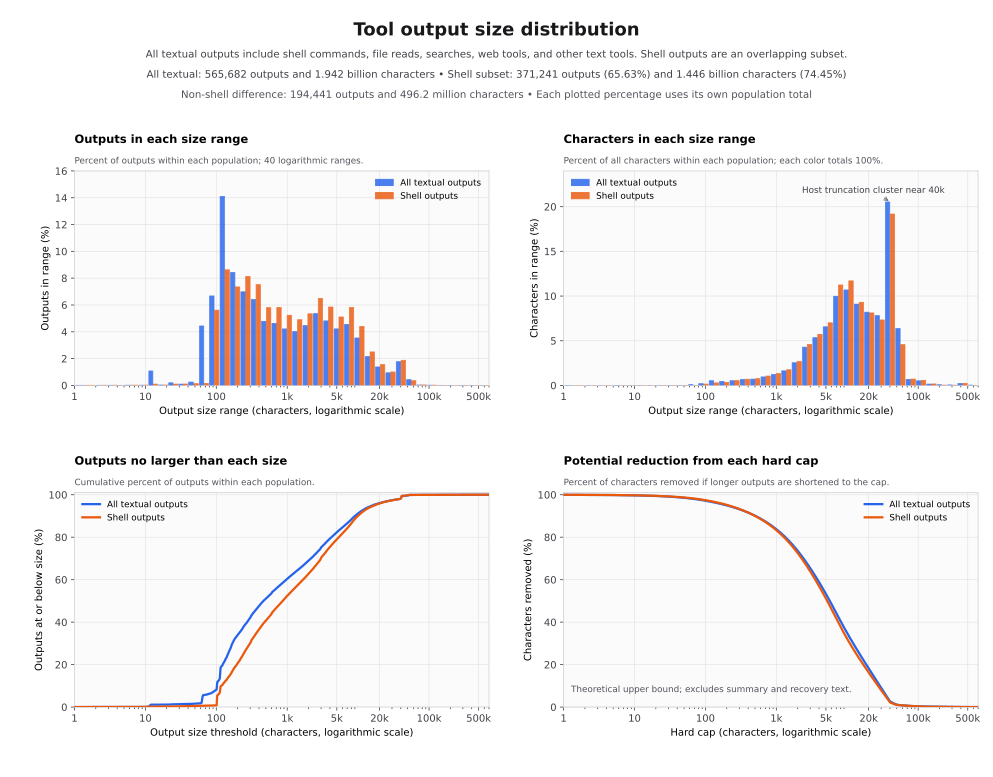

# Tool output size distribution

This report measures the number of characters in textual tool results from the private local corpus. It contains aggregate counts only. Commands, output text, paths, account names, session identifiers, and individual tool names are excluded.

The figure separates all textual outputs from the shell subset. The first two panels show where outputs and characters fall by size. The last panel shows the maximum possible character reduction from replacing every result above a chosen character cap with exactly that many characters.

## Main numbers

The corpus contains 565,682 textual outputs with 1,941,717,513 characters. Shell commands account for 371,241 outputs and 1,445,526,406 characters.

| Scope | Outputs | Characters | Mean | Median | P90 | P95 | P99 | Maximum |
| --- | ---: | ---: | ---: | ---: | ---: | ---: | ---: | ---: |
| All textual outputs | 565,682 | 1,941,717,513 | 3,432.5 | 462 | 8,995 | 16,088 | 40,169 | 628,997 |
| Shell outputs | 371,241 | 1,445,526,406 | 3,893.8 | 863 | 9,904 | 16,783 | 40,168 | 439,020 |
| Non-shell outputs | 194,441 | 496,191,107 | 2,551.9 | 156 | 5,885 | 13,695 | 40,174 | 628,997 |

Half of all textual outputs contain at most 462 characters. The mean is much higher because large outputs hold most of the text. Outputs with at least 5,000 characters make up 17.65% of results and hold 79.03% of all characters. Outputs with at least 20,000 characters make up 3.94% of results and hold 41.20% of all characters.

## Overall size bands

| Characters per output | Outputs | Share of outputs | Characters | Share of characters |
| --- | ---: | ---: | ---: | ---: |
| 0 | 12 | 0.00% | 0 | 0.00% |
| 1–99 | 45,899 | 8.11% | 2,828,630 | 0.15% |
| 100–499 | 242,857 | 42.93% | 50,610,674 | 2.61% |
| 500–703 | 27,813 | 4.92% | 16,547,300 | 0.85% |
| 704–999 | 25,120 | 4.44% | 21,210,079 | 1.09% |
| 1,000–4,999 | 124,110 | 21.94% | 316,056,244 | 16.28% |
| 5,000–19,999 | 77,601 | 13.72% | 734,556,252 | 37.83% |
| 20,000–99,999 | 22,161 | 3.92% | 781,742,362 | 40.26% |
| 100,000 or more | 109 | 0.02% | 18,165,972 | 0.94% |

## Hard-cap scenarios

These scenarios show arithmetic limits. They do not propose a policy. For a cap of `C` characters, the calculation is `sum(max(output characters - C, 0))`. It assumes that no summary, warning, or recovery text consumes space, so a real implementation would remove less.

| Character cap | All outputs above cap | Maximum reduction, all outputs | Shell outputs above cap | Maximum reduction, shell outputs |
| ---: | ---: | ---: | ---: | ---: |
| 704 | 248,954 (44.01%) | 1,696,363,805 (87.36%) | 197,374 (53.17%) | 1,259,185,364 (87.11%) |
| 1,000 | 223,919 (39.58%) | 1,626,539,830 (83.77%) | 176,845 (47.64%) | 1,203,942,446 (83.29%) |
| 2,000 | 175,477 (31.02%) | 1,429,179,034 (73.60%) | 138,155 (37.21%) | 1,048,512,598 (72.54%) |
| 4,000 | 116,799 (20.65%) | 1,142,932,934 (58.86%) | 91,400 (24.62%) | 823,668,540 (56.98%) |
| 8,000 | 66,038 (11.67%) | 789,098,211 (40.64%) | 50,309 (13.55%) | 548,702,850 (37.96%) |
| 16,000 | 28,448 (5.03%) | 454,236,542 (23.39%) | 19,855 (5.35%) | 304,735,318 (21.08%) |
| 32,000 | 13,576 (2.40%) | 148,615,203 (7.65%) | 9,076 (2.44%) | 96,848,335 (6.70%) |
| 64,000 | 342 (0.06%) | 14,242,891 (0.73%) | 266 (0.07%) | 10,302,823 (0.71%) |

The 704 rows count characters, while YARP's current rule policies use bytes. They are close only for ASCII output. This table also applies the cap to every textual result, while current YARP reduction applies only to commands selected by reviewed rules.

## Method and privacy

The report reads the private `toolcall-extractor` DuckDB database and counts Unicode scalar values in each normalized `output_text`. Results without textual output are outside the report. Shell output uses the same fixed shell-tool classification as the YARP corpus benchmark.

Percentiles use the nearest-rank method. Bands are mutually exclusive. The measurements were taken from the corpus state on 2026-08-03.

Only the aggregate numbers and generated SVG are checked into the repository. The database, raw outputs, temporary aggregate JSON, and plotting script remain outside Git.
